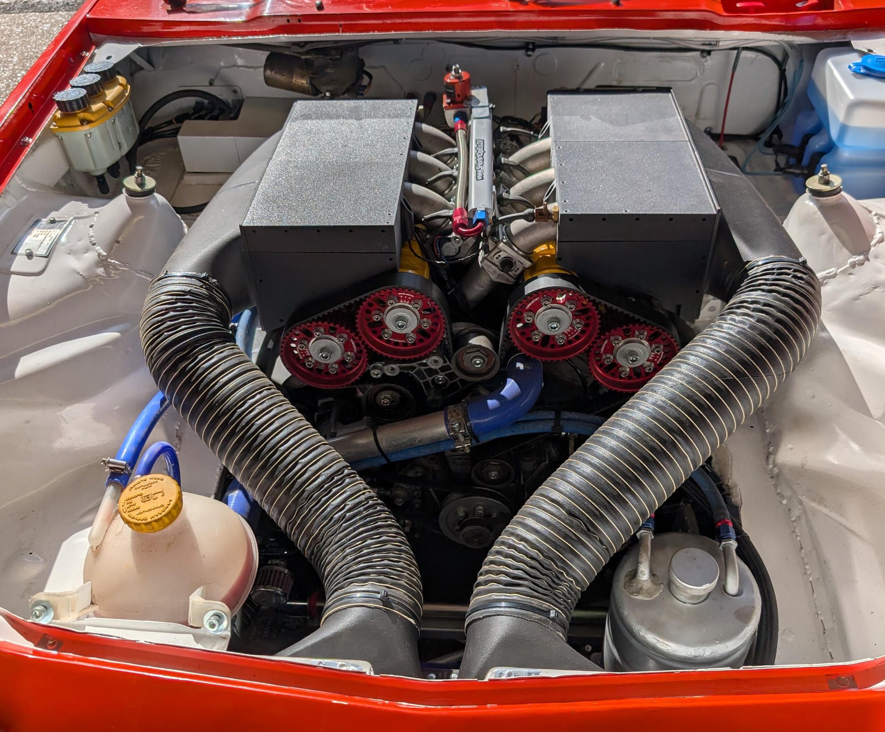

# ITB Inlets

The inlet system of the V6 is an ITB setup from Jenvey Dynamics.

Inlet manifolds: [Technical drawings of MV06](docs/jenvey-mv06-d.pdf)

## Air Boxes

To reduce the noise levels to be compatible with UK track days I designed some [airboxes](/airbox/) which can be 3d printed.

> [!NOTE]
> The air boxes work and can be printed on a Bambu Carbon X1C or similar machine, but they are far from perfect and I would call them
> development peices. Useful for referencing. They did however work very well at reducing induction noise. If you don't need to reduce
> noise, I probably wouldn't use them.
