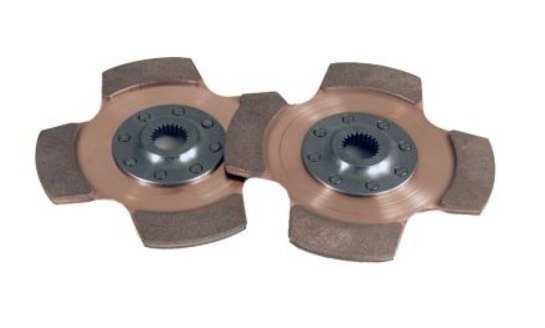
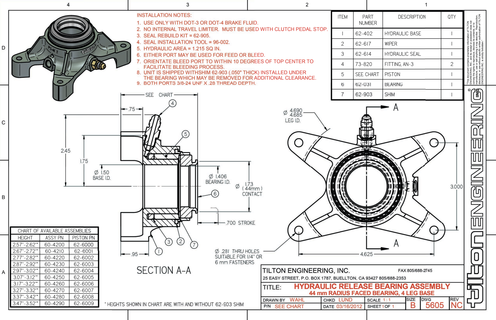
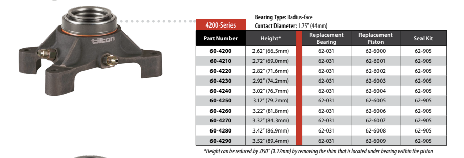
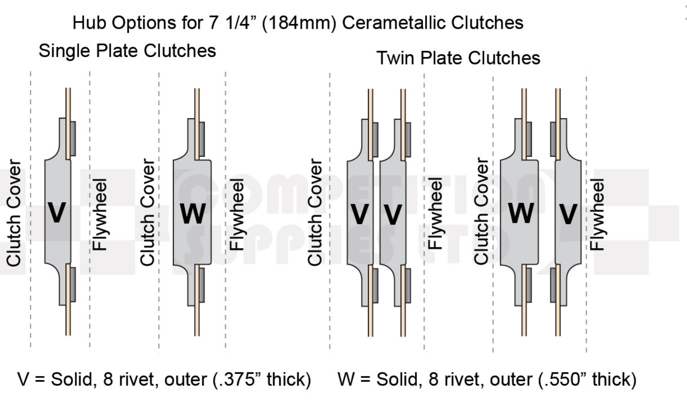

# Parts

I often forget the random parts that make up the Manta, so it's been difficult ordering spares.

- Oil Filter: [K&N HP-1002](https://www.demon-tweeks.com/uk/k-n-filters-gold-performance-oil-filter-k-nhp-1002/)
- Oil Pump Belt:
- Alternator Belt:

ECU: DTA S80

- [Wiring Diagram](docs/dta-s80-wiring-diagram.pdf)
- [Manual](docs/dta-s80-manual.pdf)

PDM: [AIM PDM32](https://www.aim-sportline.com/en/products/pdm32-pdm08/index.htm) [User Manual](https://www.aim-sportline.com/download/doc/eng/pdm32-pdm08/PDM32_user_guide_eng.pdf)
DASH: [AIM 10in](https://www.aim-sportline.com/download/technical-sheets/aim_pdm_dash_10_inches_100.pdf)

## Brakes

| Part Number | Description |
| --- | --- |
| [260-15089](https://www.wilwood.com/MasterCylinders/MasterCylinderProd?itemno=260-15091) | 0.625" Remote resevior master cylinder |
| [260-15091](https://www.wilwood.com/MasterCylinders/MasterCylinderProd?itemno=260-15091) | 0.75" Remote resevior master cylinder |

[Tilton resevior](https://motorsport-tools.com/tilton-brake-fluid-reservoir-3-in-1-pot-jic-4-7-16-unf-threaded-fittings.html)

[Wilwood GS Series compact master cylinder installation instructions (PDF)](docs/wilwood-gs-series-brake-master-cylinders.pdf)

## Flywheel

| Part Number | Description |
| --- | --- |
| [0614](https://ttvracing.com/products/?manufacturers=opel-vauxhall&engine=caterham-vauxhall&type=flywheels) | TTV Ultra-light 7.25" clutch 20XE Flywheel |

## Clutch

| Part Number | Description |
| --- | --- |
| [66-302HW (unconfirmed)](https://tiltonracing.com/product/7-25-ot-185-cerametallic-racing-clutches/) | Cover, for 44mm radius bearing |
| [64185-8-VV-30](https://tiltonracing.com/product/7-25-2-plate-cerametallic-clutch-disc-packs/) | Twin clutch pack (Two of the same, hence VV - observe orientation) |
| [66-118HR-R](https://tiltonracing.com/product/7-25-inch-cerametallic-clutch-pressure-plates/) | Pressure plate high ratio |
| [66-119](https://tiltonracing.com/product/7-25-clutch-floater-plate/) | Floating plate |
| [96-302M](https://www.competitionsupplies.com/clutches/clutch-flywheel-hardware/clutch-mount-bolt-kit-for-threaded-flywheels) | M8 Fitting Kit |

The OT-II twin-plate cerametallic clutch is a step-clutch variety to match the TTV 20XE Flywheel.

[Cover installation instructions (PDF)](docs/tilton-cerametallic-clutch-install-instructions.pdf)
[Plate installation instructions (PDF)](docs/tilton-cerametallic-disc-pack-install-instructions.pdf)

[A Tilton 7.25" OT-II High Ratio twin-plate cerametallic clutch](https://www.competitionsupplies.com/clutches/184mm-metallic-competition-clutches/tilton-7-25-184mm-cerametallic-rally-clutch/) - This link is a bit different to original tilton design.

[Mounting Hardware for Clutch](https://www.competitionsupplies.com/clutches/clutch-flywheel-hardware/clutch-mount-bolt-kit-for-threaded-flywheels)

[1" x 23 spline (-30) VV Plates](https://www.competitionsupplies.com/clutches/184mm-metallic-competition-clutches/tilton-7-25-184mm-cerametallic-clutch-8-rivet-driven-plate-disc-pack)

## Release Bearing

| Part Number | Description |
| --- | --- |
| [62-031](https://tiltonracing.com/product/replacement-44mm-radius-face-bearing-kits/) | Bearing |
| [62-905](https://tiltonracing.com/product/hrb-seal-kit-except-9000-series/) | Seal Kit |
| 62-619 | Piston |
| [61-400](docs/tilton-400-series-install-instructions.pdf) [60-4230](https://tiltonracing.com/product/4200-series-hydraulic-release-bearing-44mm-radius-face/) | Body |

The [400 series bearing was replaced by the compatible 4000 series](https://www.competitionsupplies.com/clutch-release/hydraulic-release-bearings/tilton-400-series-hydraulic-release-bearings-see-tilton-4000-series-hydraulic-release-bearings) release bearing.

The bearing hydraulic body was originally a 61-402 part with a height of 2.92" - this has been replaced with the part number 60-4230.

Some links to documentation regarding the Release bearing:

- [Bearing Installation Instructions (PDF) (Original 400 Series)](docs/tilton-400-series-install-instructions.pdf)
- [Tilton 4200 series release bearing -> tiltonracing.com](https://tiltonracing.com/product/4200-series-hydraulic-release-bearing-44mm-radius-face/)
- [Bearing Installation Instructions (PDF) (Updated 4000 series)](docs/tilton-4000-series-install-instructions-98-1133-60-42XX-HRB-web.pdf)

### Technical Drawing (4000 Series)

The plates from Tilton offer different options. The original I got were AA, but now the options are VV or VW. The image below shows the plate options.

